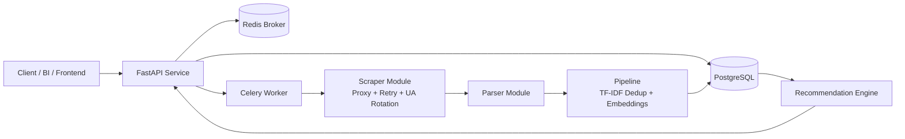

# Rental Property Web Scraper 

A production-ready REST API that scrapes rental property listings, automatically removes duplicate entries using TF-IDF + cosine similarity, and recommends similar properties based on ML embeddings.
Useful for anyone building a rental search tool, price comparison app, or real estate data pipeline — without dealing with raw HTML or duplicate data manually.
Scraping runs as a background task via Celery so the API stays fast, retries automatically on failure, and stores everything clean in PostgreSQL.

Live - https://rental-property-web-scraper-1.onrender.com/docs

---

# Problem

Manually browsing rental sites is slow, repetitive, and messy — listings are duplicated, prices are unstructured text, and there's no way to find similar properties without scrolling endlessly.

---

# Solution

Built an API that does it all automatically — scrapes listings, cleans and deduplicates the data using ML, stores it in a database, and serves smart recommendations through clean REST endpoints.

---

## What it does:

It's a REST API that automatically scrapes rental property listings from the web, cleans the data, and helps you find similar properties using ML — all running in the background without blocking your requests.

---

## How it helps:

Instead of manually browsing rental sites and copy-pasting listings, you just hit one API endpoint and get back clean, deduplicated property data with prices and addresses — plus a recommendation engine that shows you similar properties based on what you're looking at.

---

## Architecture Diagram

---

## ⚙️ Tech Stack

| Layer | Technology |
|-------|------------|
| API | FastAPI |
| Scraping | BeautifulSoup, Requests |
| ML / Similarity | Scikit-learn, NumPy (TF-IDF + Cosine Similarity) |
| Database | PostgreSQL, SQLAlchemy |
| Background Tasks | Celery, Redis |
| Deployment | Docker, Render |

---

## Key Features

- **Modular architecture**: scraper, parser, pipeline, db, api.
- **Robust scraping**:
  - Proxy rotation
  - Retry with exponential backoff + jitter
  - Randomized user-agents
- **Distributed scraping**: Celery workers with Redis broker/backend.
- **Persistence**: PostgreSQL + SQLAlchemy ORM with upsert behavior.
- **FastAPI endpoints**:
  - `GET /properties`
  - `GET /search`
  - `GET /recommend`
  - `POST /scrape`
- **AI/ML**:
  - TF-IDF-based deduplication
  - Sentence-transformer embeddings (`all-MiniLM-L6-v2`)
  - Similarity recommendation engine
- **Production concerns**:
  - Centralized logging
  - Defensive exception handling
  - Containerized runtime

## Challenges Faced

1. **Duplicate listings** - The same property appeared multiple times with slightly different text. Solved it by computing TF-IDF vectors and using cosine similarity with a 0.88 threshold to detect and remove near-duplicates before saving.
   
2. **Unstructured price data** - Prices came as raw strings like "$1,200/mo+". Built a custom parser that strips formatting, extracts numeric values, and rejects unrealistic values (negatives, outliers).
   
3. **Scraper breaking on site changes** - The parser would silently return empty data if the website HTML structure changed. Added a 4-layer HTML validator that checks structure before parsing and logs a clear warning if the expected selectors are missing.

4. **API blocking during scraping** - Running scraping synchronously made the API freeze. Moved scraping to Celery background tasks with automatic retry and exponential backoff so the API stays responsive even when scraping takes time.
