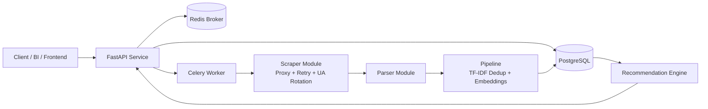

# Rental Property Web Scraper (Production Architecture)

A scalable rental-property intelligence backend with modular scraping, distributed workers, PostgreSQL persistence, and AI-assisted deduplication/recommendations.

Live - https://rental-property-web-scraper-1.onrender.com

## Architecture Diagram



## Folder Structure

```text
.
├── app
│   ├── api
│   │   └── routes.py
│   ├── core
│   │   ├── config.py
│   │   └── logging.py
│   ├── db
│   │   └── session.py
│   ├── ml
│   │   ├── deduplication.py
│   │   ├── embeddings.py
│   │   └── recommender.py
│   ├── models
│   │   ├── __init__.py
│   │   └── property.py
│   ├── schemas
│   │   └── property.py
│   ├── scraper
│   │   ├── http_client.py
│   │   ├── parser.py
│   │   └── pipeline.py
│   ├── tasks
│   │   ├── celery_app.py
│   │   └── scrape_tasks.py
│   └── main.py
├── Dockerfile
├── docker-compose.yml
├── .env.example
├── main.py
├── scraper_engine.py
└── requirements.txt
```

## Key Features

- **Modular architecture**: scraper, parser, pipeline, db, api.
- **Robust scraping**:
  - Proxy rotation
  - Retry with exponential backoff + jitter
  - Randomized user-agents
- **Distributed scraping**: Celery workers with Redis broker/backend.
- **Persistence**: PostgreSQL + SQLAlchemy ORM with upsert behavior.
- **FastAPI endpoints**:
  - `GET /properties`
  - `GET /search`
  - `GET /recommend`
  - `POST /scrape`
- **AI/ML**:
  - TF-IDF-based deduplication
  - Sentence-transformer embeddings (`all-MiniLM-L6-v2`)
  - Similarity recommendation engine
- **Production concerns**:
  - Centralized logging
  - Defensive exception handling
  - Containerized runtime

## Local Deployment Steps

1. **Configure env**
   ```bash
   cp .env.example .env
   ```

2. **Build + start services**
   ```bash
   docker compose up --build
   ```

3. **Trigger scrape job**
   ```bash
   curl -X POST http://localhost:8000/scrape
   ```

4. **Read data**
   ```bash
   curl "http://localhost:8000/properties"
   curl "http://localhost:8000/search?q=Street&min_price=1000&max_price=4000"
   curl "http://localhost:8000/recommend?property_id=1"
   ```

## Scaling Notes

- Scale workers independently:
  ```bash
  docker compose up --scale worker=4
  ```
- Move secrets to managed secret storage in production.
- Add Alembic migrations and observability stack (Prometheus/Grafana/OTel) for larger deployments.
