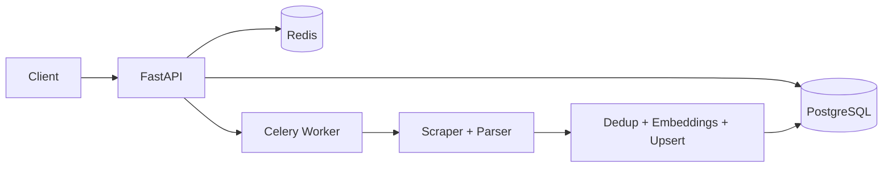

# Rental Property Web Scraper (Production Architecture)

A scalable rental-property intelligence backend with modular scraping, distributed workers, PostgreSQL persistence, and AI-assisted deduplication/recommendations.

## Architecture Diagram



## Folder Structure

```text
.
├── app/
│   ├── api/                # routes + auth dependencies
│   ├── core/               # settings + structured logging
│   ├── db/                 # engine/session + db health checks
│   ├── ml/                 # TF-IDF dedup, embeddings, recommender
│   ├── models/             # SQLAlchemy ORM models
│   ├── schemas/            # Pydantic response schemas
│   ├── scraper/            # http client, parser, ingestion pipeline
│   ├── tasks/              # Celery app + tasks
│   └── main.py             # FastAPI app entrypoint
├── tests/
├── docker-compose.yml      # local dev
├── docker-compose.prod.yml # production profile
├── Dockerfile
├── Procfile
├── requirements.txt
└── .env.example
```

## Key Production Fixes

- No hardcoded credentials in code (env-driven settings only).
- Pinned dependency versions for reproducible builds.
- DB connection validation and readiness checks.
- Celery retry with exponential backoff and jitter.
- API key auth, rate limiting, CORS, structured JSON logs.
- Request timeout middleware.
- Separate `docker-compose.prod.yml` with no bind mounts and resource limits.
- Procfile naming fixed (`Procfile`, not `Procfile.txt`).

## Endpoints

- `GET /health/live`
- `GET /health/ready`
- `POST /scrape`
- `GET /properties`
- `GET /search?q=...`
- `GET /recommend?property_id=...`

> Protected routes require `X-API-Key` header.

## Deployment

1. Copy environment file:
   ```bash
   cp .env.example .env
   ```
2. Start local stack:
   ```bash
   docker compose up --build
   ```
3. Start production-like stack:
   ```bash
   docker compose -f docker-compose.prod.yml up --build -d
   ```
4. Gunicorn command (PaaS):
   ```bash
   gunicorn app:app -k uvicorn.workers.UvicornWorker --bind 0.0.0.0:$PORT
   ```

## Basic checks

```bash
curl http://localhost:8000/health/live
curl http://localhost:8000/health/ready
curl -H "X-API-Key: $API_KEY" -X POST http://localhost:8000/scrape
```
